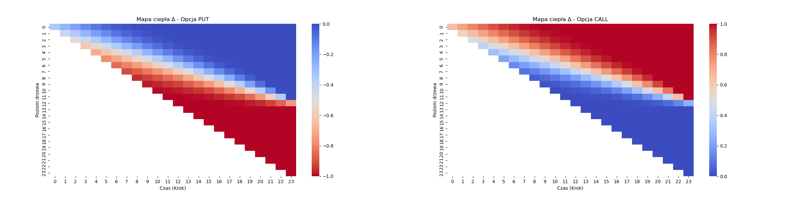

```{r message=FALSE, warning=FALSE, include=FALSE}
library(reshape2)
library(ggplot2)
require(gridExtra)
library(grid)
library(kableExtra)
source("BOPM w R.R")
```


\newpage

# Wprowadzenie

Głównym celem raportu jest analiza modelu dwumianowego wyceny opcji waniliowych typu put i call na aktywa nie wypłacające dywidend. Rozpoczniemy od przedstawienia ogólnych założeń dotyczących modelu wraz z jego przykładowym zastosowaniem przy pewnych ustalonych parametrach. Następnie, zajmiemy się zbadaniem wrażliwości wyceny wynikającej z modelu ze względu na zmianę parametrów modelu oraz porównamy różnicę w wynikach między opcjami europejskimi i amerykańskimi. Przyjrzymy się również składowi portfela zabezpieczającego wyceniane opcje oraz jego zmianom przy rozwoju ceny aktywa bazowego.

# Założenia dotyczące modelu

Zakładamy dwumianowy model rynku, w którym aktywo bazowe (nie wypłacające dywidend) warte w chwili $t$ kwotę $S_t$ może w kolejnym kroku (tj. po upływie pewnej ustalonej ilości czasu, oznaczanej przez $\Delta t$) być warte $S_t \cdot u$ lub $S_t \cdot d$, gdzie $u = e^{\sigma \sqrt{\Delta t}}$ i $d = e^{-\sigma \sqrt{\Delta t}}$ są współczynnikami odpowiednio wzrostu i spadku ceny, kontrolowanymi przez parametr zmienności $\sigma$. Poza aktywem bazowym dysponujemy równiez możliwością inwestycji lub pożyczki ze stałą stopą wolną od ryzyka $r$ (w każdym okresie, zakładamy oprocentowanie ciągłe).

Przy takich założeniach wyznaczamy wartość opcji (o zapadalności $T$ lat i cenie wykonania $K$) na chwilę zero. Rozpoczynamy od wyznaczenia możliwych wartości opcji w chwili $T$, czyli po prostu wartości wewnetrznych (dla opcji typu call $\max (S_T - K, 0)$, a dla opcji typu put $\max (K - S_T, 0)$); następnie, cofając się o kolejne kroki w czasie wyznaczamy wartość opcji w oparciu o metodę $\Delta$-hedgingu (lub równoważnie, korzystając z założenia o mierze obojętnej na ryzyko, tj. wartość opcji jest zdyskontowaną wartością oczekiwaną jej przyszłego *payoffu*), przy czym, w przypadku opcji amerykańskich porównujemy uzyskaną wartość z wartością wewnętrzną opcji i bierzemy większą z nich (ze względu na możliwość wcześniejszego wykonania opcji). Kontynuując ten proces, finalnie otrzymujemy wartość opcji w chwili początkowej.

# Przykładowe zastosowania modelu

W tym rozdziale przedstawimy przykładowe zastosowanie modelu do wyceny opcji. Jak już wspomnieliśmy, będziemy rozważać następujące cztery przypadki:

-   opcje europejskie typu call i put,

-   opcje amerykańskie typu call i put.

Przyjmujemy następujące parametry, na podstawie których dokonamy przykładowej wyceny:
$$
S_o = 50,\;\; K = 48,\;\; T = 2,\;\; \Delta t = 1/12,\;\; \sigma = 0.3,\;\; r = 0.02
$$
W następnych dwóch podrozdziałach zaprezentujemy uzyskane wyniki dla każdego z przypadków, porównamy je między sobą i wyciągniemy wnioski. Zanim jednak do tego przejdziemy, krótko opiszemy strukturę uzyskanego modelu dla takich parametrów. Zauważmy, że ze względu na przyjęte wartości parametrów $T$ oraz $\Delta t$ model zawiera aż $325$ wierzchołków (tj. rozważanych momentów w czasie z różną ceną aktywa bazowego) z czego 25 z nich dotyczy chwili wygaśnięcia opcji. Wynika z tego, że dokonujemy wyceny w oparciu o $25$ możliwych przyszłych wartości aktywa bazowego w owej chwili wygaśnięcia. Dla takiej liczby wierzchołków wraz z przyjętą wysokością parametru zmienności $\sigma$ największą osiągalną wartością aktywa bazowego jest $399.61$, co daje przyrost rzędu $(399.61 - 50)/50 \approx 6.99$ (czyli o prawie $700 \%$), a najmniejszą jest $6.26$, co daje spadek rzędu $(6.26 - 50)/50 \approx - 0.87$ (czyli o blisko $87\%$).

## Wycena opcji europejskich call i put

Rozpoczniemy od przykładowej wyceny opcji europejskich. Po dokonaniu wyceny omawianym modelem dla ustalonych parametrów, wartość opcji w chwili zero wynosi (w zaokrągleniu do dwóch miejsc po przecinku):

-   w przypadku opcji call: $10.19$,

-   w przypadku opcji put: $6.31$.

Jak widzimy, wartość opcji call jest istotnie wyższa od wartości opcji put dla tych parametrów. Nie jest to zaskoczeniem, bowiem zgadza się z parytetem put-call - zauważmy, że przy przyjętych parametrach zachodzi relacja $S_0 \ge K > 0$, a z parytetu put-call mamy:
$$
C_0 - P_0 = S_0 - Ke^{-rT} \ge K - Ke^{-rT} = K(1 - e^{-rT}) > 0
$$
gdzie $C_0$ i $P_0$ są cenami odpowiednio opcji call i put w chwili zero. Analogicznymi przekształceniami możemy uzyskać wartość parametru $K$ tak, aby (przy pozostałych parametrach niezmienionych) relacja uzyskanych wartości opcji call i put się odwróciła.

Przyjrzyjmy sie teraz ewolucji wartości opcji w drzewach dwumianowych wynikających z rozważanego modelu. Na poniższych dwóch ilustracjach przedstawiamy owe drzewa dla obu opcji: po lewej dla opcji call, a po prawej dla opcji put. Kolor danego wierzchołka jest bezpośrednio związany z odpowiadającą mu wyznaczoną wartością opcji - jeśli wartość ta jest dodatnia to wierzchołek oznaczony jest kolorem zielonym, a jeśli wartość wynosi zero to kolorem czerwonym.

```{r echo=FALSE, message=FALSE, warning=FALSE, fig.align='center', fig.height=4, fig.width=4, out.extra='trim=0 50 0 45,clip'}
df1 <- melt(option_values_from_bopm(2, 1/12, 0.3, 50, 48, 0.02, 'call', 'european'), varnames = c("node", "time"), value.name = "value")
df1$node_sym <- df1$time / 2 - df1$node

df2 <- melt(option_values_from_bopm(2, 1/12, 0.3, 50, 48, 0.02, 'put', 'european'), varnames = c("node", "time"), value.name = "value")
df2$node_sym <- df2$time / 2 - df2$node

df1$color_group <- ifelse(df1$value > 0, "green", "red")
p1 = ggplot(df1, aes(x = time, y = node_sym, fill = color_group)) +
  geom_tile() +
  scale_fill_manual(
    values = c("green" = "green", "red" = "red"),
    na.value = "white"
  ) +
  scale_y_continuous(limits = c(-15, 15), expand = expansion(mult = c(0.01, 0.01))) +
  labs(
    title = "Opcja call",
    x = "Krok "
  ) +
  theme(
    panel.background = element_blank(),     
    panel.grid = element_blank(),           
    axis.ticks.y = element_blank(),         
    axis.text.y = element_blank(),          
    axis.title.y = element_blank(),  
    axis.title.x = element_blank(),
    legend.position = "none",  
    axis.line.y = element_blank() ,
    plot.title = element_text(hjust = 0.5)
  ) +
  coord_fixed()


df2$color_group <- ifelse(df2$value > 0, "green", "red")
p2 = ggplot(df2, aes(x = time, y = node_sym, fill = color_group)) +
  geom_tile() +
  scale_fill_manual(
    values = c("green" = "green", "red" = "red"),
    na.value = "white"
  ) +
  scale_y_continuous(limits = c(-15, 15), expand = expansion(mult = c(0.01, 0.01))) +
  labs(
    title = "Opcja put",
    x = "Krok "
  ) +
  theme(
    panel.background = element_blank(),     
    panel.grid = element_blank(),           
    axis.ticks.y = element_blank(),         
    axis.text.y = element_blank(),          
    axis.title.y = element_blank(),
    axis.title.x = element_blank(),
    legend.position = "none",  
    axis.line.y = element_blank() ,
    plot.title = element_text(hjust = 0.5)
  ) +
  coord_fixed()


grid.arrange(p1, p2, ncol=2, bottom = textGrob(expression("Krok (" * Delta * "t)"), vjust = -3.5, gp = gpar(fontsize = 12)))
```

*Rysunek 1. Drzewa wyceny opcji europejskich typu call i put. Kolor zielony oznacza dodatnią wartość wyceny, czerwony oznacza zerową wartość wyceny.*

Rozpocznijmy od pewnej bardzo prostej obserwacji - obie wizualizacje zgadzają się z podstawowymi oczekiwaniami dotyczącymi obu rodzajów opcji, tzn. wartość opcji call jest zerowa przy dużych spadkach cen, natomiast wartość opcji put jest zerowa przy dużych wzrostach cen. Po dokładniejszym przyjrzeniu się obu wykresom zauważymy jednak, że to opcja put wcześniej (tj. po mniejszej liczbie wzrostów/spadków cen) wyceniana jest jako bezwartościowa, co łączy się oczywiście z tym, że w większej ilości wierzchołków jej wartość jest równa $0$. 

[...]

## Wycena opcji amerykańskich call i put

Przejdziemy teraz do przykładowej wyceny opcji amerykańskich. Przypomnijmy na początku, że różnicą między tym rodzajem opcji, a opcjami rodzaju europejskiego jest możliwość wykonania opcji w dowolnym momencie - ma to oczywiście znaczący wpływ na jej wartość. Po dokonaniu wyceny omawianym modelem dla ustalonych parametrów, wartość opcji w chwili zero wynosi (w zaokrągleniu do dwóch miejsc po przecinku):

-   w przypadku opcji call: $10.19$,

-   w przypadku opcji put: $6.47$.

Jak widzimy, relacja między uzyskanymi wartościami jest taka sama jak w przypadku opcji europejskich. Tym razem jednak, nie jesteśmy w stanie powiedzieć że jest to rezultat zgodny z parytetem put-call, bowiem nie obowiązuje on w przypadku opcji amerykańskich. Ze względu na możliwość wcześniejszego wykonania opcji relacja między cenami opcjami obu typów jest znacznie bardziej skomplikowana.

Zwróćmy jednak uwagę na pewną ciekawą prawidłowość - wartość opcji europejskiej typu call jest równa wartości opcji amerykańskiej typu call. Początkowo może się wydawać, że jest to zwykły przypadek wynikający z akurat takiej konfiguracji parametrów; zauważmy jednak, że jedynym czynnikiem mogącym wywołać zmianę w wycenie obu tych opcji jest możliwość przedwczesnego wykonania opcji amerykańskiej. Jednakże, po zbadaniu potencjalnej opłacalności takiego działania dochodzimy do wniosku, że przedwczesne wykonanie opcji (przypomnijmy, zakładamy brak wypłacanych dywidend dla aktywa bazowego) call nigdy nie jest opłacalne, co poprawnie odzwierciedla wykorzystany przez nas model wyceny. Rozważmy bowiem następujący scenariusz:^[argumentacja zainspirowana rozdziałem 11.5 książki *Options, futures and other derivatives* autorstwa Johna C. Hulla.] załóżmy, że w danej chwili przed upływem ważności opcji aktywo bazowe warte jest 50 PLN, a cena wykonania wynosi 40 PLN. Jeśli zależy nam na posiadaniu owego aktywa, lepiej zapłacić cenę wykonania później, ponieważ: (1) 40 PLN, które zapłacimy w przyszłości warte jest mniej niż te, które zapłacilibyśmy teraz oraz (2) istnieje szansa, że cena aktywa spadnie nawet poniżej ceny wykonania. Jeśli natomiast nie interesuje nas posiadanie aktywa, a jedynie zarobek, to bardziej opłacalnym działaniem jest sprzedanie całej opcji (której cena musi być większa niż wartość wewnętrzna, tj. przychód z natychmiastowego wykonania), lub sprzedanie krótko aktywa bazowego i dostarczenie go w momencie wykonania opcji, kiedy to cena aktywa może spaść nawet poniżej ceny wykonania.

Równości cen opcji europejskich i amerykańskich typu put oczywiście nie zachodzi. W tym przypadku możliwość przedwczesnego wykonania opcji w wielu momentach jest jak najbardziej działaniem optymalnym, a argumentacja analogiczna do tej z powyższego akapitu oczywiście nie znajduje zastosowania. Bierze się to między innymi z faktu, że spadek (oraz jego tempo) ceny aktywa bazowego jest znacznie mniejszy (oraz ograniczony!) od jego wzrostu w rozważanym przez nas modelu. Do analizy momentów przedwczesnego wykonania jeszcze wrócimy, póki co zbadajmy, tak jak dla opcji europejskich, ewolucje wartości opcji w drzewach dwumianowych dla rozważanych opcji amerykańskich.

```{r echo=FALSE, message=FALSE, warning=FALSE, fig.align='center', fig.height=4, fig.width=4, out.extra='trim=0 50 0 45,clip'}
df3 <- melt(option_values_from_bopm(2, 1/12, 0.3, 50, 48, 0.02, 'call', 'american')[[1]], varnames = c("node", "time"), value.name = "value")
df3$node_sym <- df3$time / 2 - df3$node

df4 <- melt(option_values_from_bopm(2, 1/12, 0.3, 50, 48, 0.02, 'put', 'american')[[1]], varnames = c("node", "time"), value.name = "value")
df4$node_sym <- df4$time / 2 - df4$node

df3$color_group <- ifelse(df3$value > 0, "green", "red")
p3 = ggplot(df1, aes(x = time, y = node_sym, fill = color_group)) +
  geom_tile() +
  scale_fill_manual(
    values = c("green" = "green", "red" = "red"),
    na.value = "white"
  ) +
  scale_y_continuous(limits = c(-15, 15), expand = expansion(mult = c(0.01, 0.01))) +
  labs(
    title = "Opcja call",
    x = "Krok "
  ) +
  theme(
    panel.background = element_blank(),     
    panel.grid = element_blank(),           
    axis.ticks.y = element_blank(),         
    axis.text.y = element_blank(),          
    axis.title.y = element_blank(),  
    axis.title.x = element_blank(),
    legend.position = "none",  
    axis.line.y = element_blank() ,
    plot.title = element_text(hjust = 0.5)
  ) +
  coord_fixed()


df4$color_group <- ifelse(df4$value > 0, "green", "red")
p4 = ggplot(df4, aes(x = time, y = node_sym, fill = color_group)) +
  geom_tile() +
  scale_fill_manual(
    values = c("green" = "green", "red" = "red"),
    na.value = "white"
  ) +
  scale_y_continuous(limits = c(-15, 15), expand = expansion(mult = c(0.01, 0.01))) +
  labs(
    title = "Opcja put",
    x = "Krok "
  ) +
  theme(
    panel.background = element_blank(),     
    panel.grid = element_blank(),           
    axis.ticks.y = element_blank(),         
    axis.text.y = element_blank(),          
    axis.title.y = element_blank(),
    axis.title.x = element_blank(),
    legend.position = "none",  
    axis.line.y = element_blank() ,
    plot.title = element_text(hjust = 0.5)
  ) +
  coord_fixed()


grid.arrange(p3, p4, ncol=2, bottom = textGrob(expression("Krok (" * Delta * "t)"), vjust = -3.5, gp = gpar(fontsize = 12)))
```

*Rysunek 2. Drzewa wyceny opcji europejskich typu call i put. Kolor zielony oznacza dodatnią wartość wyceny, czerwony oznacza zerową wartość wyceny.*

Jak widzimy, oba drzewa wyglądają właściwie tak samo jak w przypadku opcji europejskich - nie powinno to nas zaskakiwać na pewno w przypadku opcji call, ponieważ ustaliśmy, że dla nich przedwczesne wykonanie nie jest działaniem optymalnym, więc wycena jest taka sama dla opcji europejskich. Inaczej wygląda sytuacja w przypadku opcji typu put; wtedy już przedwczesne wykonanie niejednokrotnie się opłaca, choć nie sprawia ono, że w niektórych wierzchołkach opcja zostałaby wyceniona na dodatnią, podczas gdy jej europejski odpowiednik wyceniany jest na zero. Możliwość ta wpływa jedynie na zwiększenie już dodatniej wartości opcji w danym wierzchołku. Momenty optymalnego przedwczesnego wykonania oraz wynikające z nich różnice w cenie między amerykańską i europejską opcją put przedstawiają poniższe ilustracje.

```{r, echo=FALSE, out.width="75%", fig.align='center'}
# wykres jako obrazek bo optymalnie go przeskalowac/upozycjonowac to nie lada wyzwanie;
# ogolnie do potencjalnej zmiany w przyszlosci

```

*Rysunek 3. Drzewa wyceny opcji amerykańskich typu put. Rysunek po lewej zawiera drzewo z momentami optymalnego wykonania opcji, gdzie kolor niebieski odpowiada wierzchołkowi, który odpowiada momentowi w czasie, kiedy wykonanie opcji jest optymalnym działaniem; w przeciwnym wypadku wierzchołek oznaczony jest kolorem szarym. Rysunek po prawej zawiera drzewo wyceny z różnicami wartości opcji w danym wierzchołku między amerykańską i europejską opcją put.*

[...]

# Analiza wrażliwości modelu

W tym rozdziale zajmiemy się analizą wrażliwości wyceny modelu dwumianowego. Jest to jedna z najważniejszych kwestii efektywności modeli wyceny aktywów finansowych, bowiem ich parametryzacja często opiera się na realizacjach pewnych zjawisk, które nie są znane osobom wyceniającym dane aktywa. Prawdopodobnie najbardziej istotnym z tych zjawisk jest zmienność rynku - w naszym przypadku jest to *de facto* pytanie o dobór wartości parametrów dotyczących zmienności ceny aktywa bazowego, czyli parametr $\sigma$ oraz wysokości stopy procentowej $r$. Problem odpowiedniej parametryzacji nie kończy się jednak wyłącznie na dokładnej estymacji wartości dotyczących zmienność rynku; równie ważna jest strona parametryzacji technicznej, tj. tej dotyczącej wyłącznie struktury modelu, nie odnoszącej się bezpośrednio do faktycznej rzeczywistości związanej z modelowanymi instrumentami finansowymi - w naszym przypadku jest to przede wszystkim parametr $\Delta t$ kontrolujący liczbę 'kroków' w modelu, którego zmiana może mieć znaczący wpływ na finalną wycenę danej opcji.

W następnych dwóch podrozdziałach przeanalizujemy wpływ zmiany pojedynczego parametru na zmianę wyceny opcji - rozpoczniemy od zbadania zmian parametrów $S_0, K, T, \sigma$ i $r$, tj. tych bezpośrednio odnoszących się do ogólnie pojętej sytuacji rynkowej, po czym przyjrzymy się jakie zmiany wywołuje wykorzystanie innych wartości parametru $\Delta t$. W ostatnim, trzecim podrozdziale zbadamy wspólny wpływ zmian w różnych parach parametrów.

[...]


## Wpływ zmiany parametrów $S_0, K, T, \sigma$ i $r$

[...]

## Wpływ zmiany parametru $\Delta t$

[...]

## Wpływ równoczesnej zmiany różnych par parametrów

[...]


# Analiza składu portfela zabezpieczającego
Na poniższym wykresie przedstawiono zmiany wartości delty w funkcji czasu oraz poziomu drzewa binarnego, odpowiadającego liczbie wzrostów ceny aktywa bazowego. Wartość delty odzwierciedla liczbę jednostek instrumentu bazowego (np. akcji), 
które należy utrzymywać w portfelu, aby skutecznie zabezpieczyć się przed ryzykiem zmian ceny aktywa. 
Innymi słowy, delta określa nachylenie zależności między wartością portfela replikującego a ceną instrumentu bazowego.
```{r, echo=FALSE, out.width="75%", fig.align='center'}

```
W przypadku opcji typu put, jak w analizowanym przykładzie, wartości delty są zazwyczaj ujemne — oznacza to, że dla zreplikowania opcji inwestor powinien przyjąć pozycję krótką na akcjach. Można również zaobserwować, że delta maleje (czyli staje się bardziej ujemna) 
w sytuacjach spadków cen instrumentu bazowego. To zgodne z intuicją: im niższa cena akcji, tym większa wartość opcji put, co wymusza większe zabezpieczenie przez pozycję przeciwną.
Wraz z upływem czasu, czyli w miarę zbliżania się do terminu wygaśnięcia opcji, wartości delty stają się bardziej ekstremalne — to znaczy bardziej zbliżają się do -1 lub 0. Jest to efektem rosnącej wrażliwości 
wartości opcji na zmiany ceny aktywa w ostatnich momentach życia opcji. Taka dynamika wymusza częstsze i bardziej znaczące dostosowania pozycji w portfelu, co pokazuje rosnące wyzwania związane z praktycznym stosowaniem strategii delta-hedgingu w końcowych etapach życia opcji.


# Dodatek: Implementacja modelu

[...]


```{r, include=TRUE ,warning=FALSE, message=FALSE, echo=FALSE}
do_zapisywania<-data.frame(matrix(ncol = 3,nrow = 3))
colnames(do_zapisywania)<-c("nazwa pliku","nazwa funkcji","parametry")
rownames(do_zapisywania)<-c("Wykres 1","Wykres 2","Wykres 3")
do_zapisywania[1,]<-c("wyniki_zad1.csv","policz_i_zapisz_wyniki_zad1","n=1000,k=1000")
do_zapisywania[2,]<-c("wyniki_zad2_n_1000.csv","read_numbers_and_save_p_values","n=1000")
do_zapisywania[3,]<-c("wyniki_zad2_n_5000.csv","read_numbers_and_save_p_values","n=5000")
kable(do_zapisywania)

```


